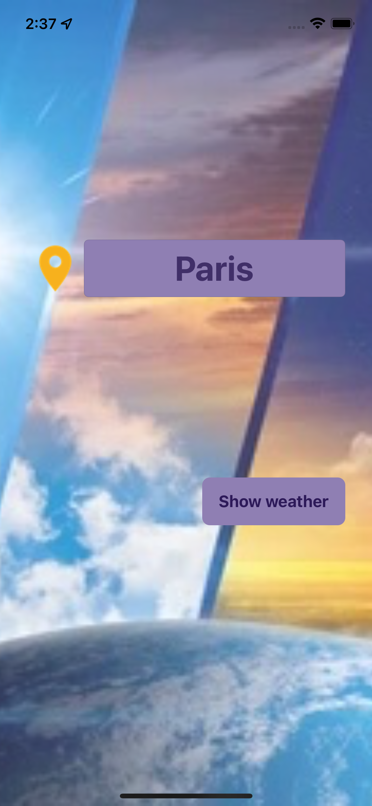
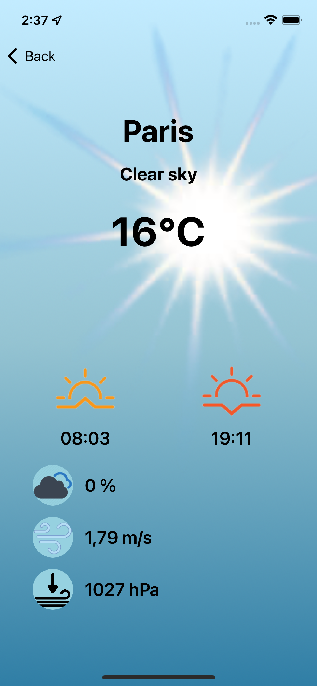

# WEATHER - current weather app for iOS
An easy way to check the weather in any city in the world.
  
## Table of Contents
* [Introduction](#introduction)
* [Requirements](#requirements)
* [Installation](#installation)
* [Technologies](#technologies)
* [Features](#features)
* [Sources](#sources)
* [Contacts](#contacts)

## Introduction
**Weather** app is a web-based application, which allows to get current weather and other climatic characteristics for a certain city.  
  
 | 
:---------------------------------------: | :---------------------------------------:

## Requirements
* Xcode 13.0 or later
* iOS 15.0 or later

## Installation
1. Clone the repository:  
   * using HTTPS:  
`$ git clone https://github.com/milaplatonova/Weather.git`
    * using SSH:  
`$ git clone git@github.com:milaplatonova/Weather.git`
1. Add Alamofire as a git submodule:  
`$ git submodule add https://github.com/Alamofire/Alamofire.git`
1. Open the project in Xcode:  
`$ open Weather.xcworkspace`
1. Choose the **iOS Simulator**, Build and Run the project.

## Technologies
**Alerts**  
Alerts are displayed to notify the user about emerged errors.  
  
**Alamofire**  
Alamofire framework is used to receive weather data for a certain city from [Open Weather Map](https://openweathermap.org/) website.  
  
**DispatchQueue**  
The app uses an asynchronous dispatch queue to make a network request. 
  
**CoreLocation**  
The App uses CLLocationManager to define the device's current location.  
  
**Gesture Recognizer**  
UITapGestureRecognizer is used to dismiss the keyboard.

## Features
* locating
* current weather for any city, including the following characteristics:  
  :thermometer: temperature  
  :sun_behind_rain_cloud: weather description  
  :sunny: sunrise & sunset time  
  :cloud: cloudiness  
  :wind_face: wind speed  
  :cyclone: pressure  
* depending on weather background
* tap gestures to hide the keyboard  
  

  
## Sources
Weather App uses the [Open Weather Map](https://openweathermap.org/) website to access weather data by making requests with specific parameters to a URL.
  
## Contacts
Lyudmila Platonova  
:email: milaplatonova@icloud.com  
:bust_in_silhouette: [LinkedIn](linkedin.com/in/lyudmila-platonova-916097222)
